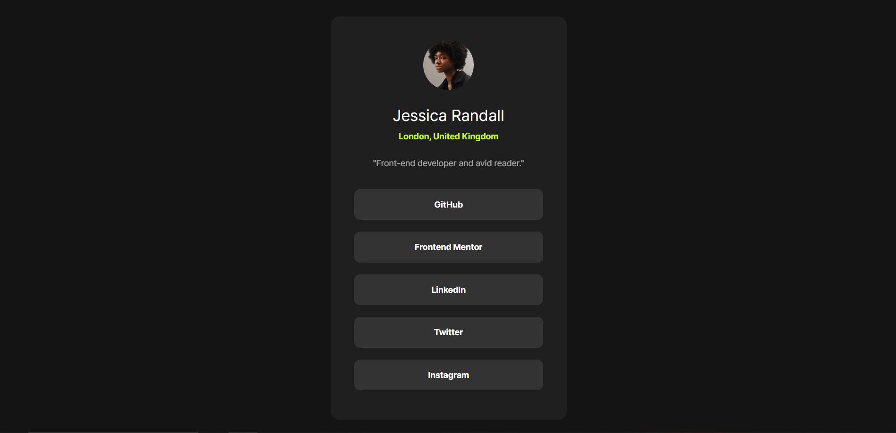
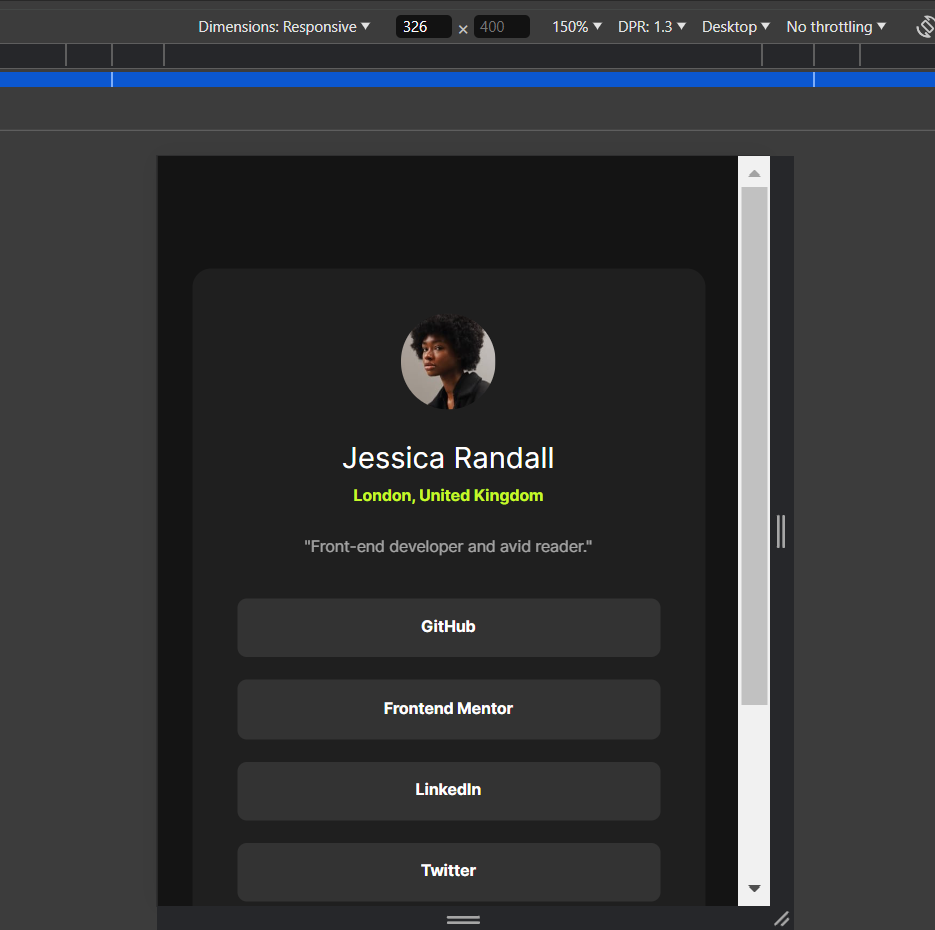
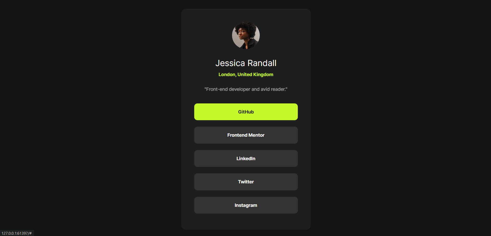

# Frontend Mentor - Social links profile solution

This is my solution to the [Social links profile challenge on Frontend Mentor](https://www.frontendmentor.io/challenges/social-links-profile-UG32l9m6dQ). Frontend Mentor challenges help you improve your coding skills by building realistic projects.

## Table of contents

- [Overview](#overview)
  - [The challenge](#the-challenge)
  - [Screenshot](#screenshot)
  - [Links](#links)
- [My process](#my-process)
  - [Built with](#built-with)

## Overview

Eventhough this is a simple layout. This challenge has helped me practice my skills in grid and flexbox.

### The challenge

Users should be able to:

- See hover and focus states for all interactive elements on the page

### Screenshot

### Links

- Solution URL: [Add solution URL here](https://github.com/huz3y/social-links-profile-main)

## My process

### Built with

- Semantic HTML5 markup
- CSS custom properties
- Sass (SCSS)
- Flexbox
- CSS Grid
- Desktop-first workflow
